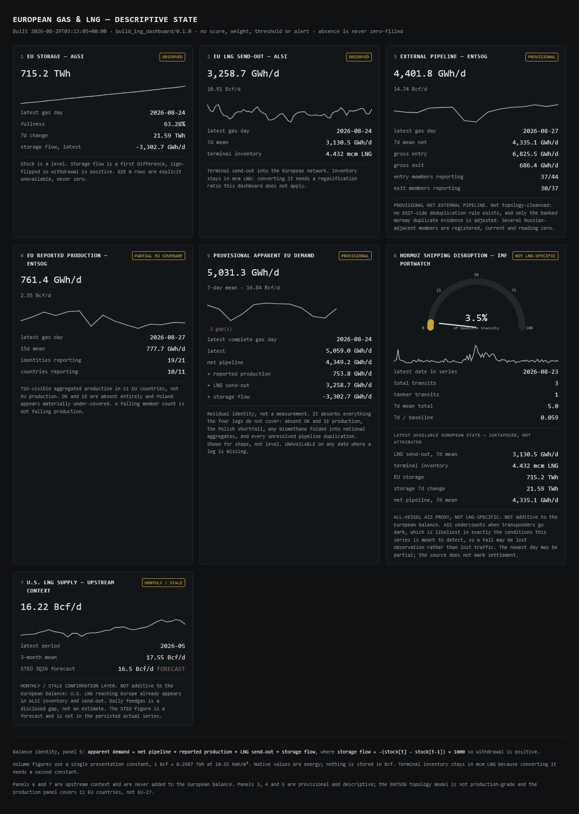

C:\Projects\energy-security-dashboards\README.md# Oil and LNG Physical-Balance Dashboards

*A transit log for the Strait of Hormuz and its effects on global
balances for crude oil, refined products, and LNG.*

---

## Why I created these dashboards

The most consequential physical question during the Strait disruption — how much
energy is actually moving through the Strait of Hormuz — was being answered
mostly by political assertions.

Vessel counts and transit figures circulated widely. Almost none disclosed how
the figure was derived:

- **What was counted.** Crude tankers? Product tankers? LNG carriers? All hulls
  including bunkering and support traffic? The same headline figure got used
  for all of these.
- **Where it came from.** The same figure was repeated by several outlets,
  implying independent confirmation.
- **What was assumed.** Dark transits and ship-to-ship transfers were mentioned,
  but assumed volumes for them were folded into observed totals without being
  identified separately.

An announcement that the Strait has reopened is a statement of intent.
Normalisation is a physical condition with observable signatures, and those
signatures arrive at different speeds in different systems.

So I built these dashboards: a stable view of Strait throughput and its effects
on global energy balances. Each data point carries its provenance; if that
provenance cannot be established, the point is not presented as a measurement.

The implementation is private. What is public here is the methodology, the
findings and, most importantly, a record of which data I could verify, which I
could not, and why.

---

## European gas and LNG — descriptive physical balance

*The dashboard reports the available physical state without reducing it to a
composite score. Provisional or incomplete observations remain clearly marked,
and missing data is never treated as zero.*

Read the badges. `PROVISIONAL` on external pipeline. `PARTIAL EU COVERAGE` on
reported production. `NOT LNG-SPECIFIC` on the shipping card. Those are not
disclaimers bolted onto a finished product — they are the product. Each card
states what it measures, and, where the measurement is incomplete, says so on
its face rather than in a footnote nobody reaches.

Examples:

- **External pipeline flow** is displayed at 4,401.8 GWh/d, but the same
  cross-border flow may be reported from both sides of a pipeline connection.
  Until I can consistently identify and remove those duplicates, the total
  remains provisional, not a validated measurement of European pipeline
  imports. The dashboard states this limitation alongside the figure.
- **Apparent demand** is labelled a residual identity, not a measurement. It
  absorbs every error in the terms above it, and saying so is the difference
  between a balance and a plug.
- **Two cards provide context only.** Shipping transits and U.S. LNG supply are
  excluded from the European balance. U.S. cargoes reaching Europe already
  appear in terminal inventory and send-out, so adding them again would
  double-count them.

The storage series comes from AGSI and the terminal series from ALSI, both
operated by Gas Infrastructure Europe. Each contains 2,199 daily observations
spanning 2020-08-17 through 2026-08-24. That history supports 1-day, 7-day,
30-day and year-on-year changes, seasonal ranks and empirical percentiles. The
dashboard further reports observation counts, the confirmed or estimated status
of the current reading and its historical reference sample.

**Each series is stored in the unit published by its source.** GIE and ENTSOG
report European gas in TWh and GWh, while EIA reports U.S. LNG supply in Bcf/d.
For comparison, the dashboard converts energy figures to Bcf-equivalent at
display using the stated constant, 1 Bcf = 0.2987 TWh at 10.55 kWh/m³. Keeping
that assumption out of the stored observations preserves direct reconciliation
to the source and allows the presentation convention to change without
rewriting history. Terminal inventory remains in mcm LNG because converting
liquid LNG to pipeline-gas volume would require an additional regasification
assumption.

**The absence of a gas score is a decision.** The physical chain
runs liquefaction → carrier → terminal → pipeline → storage → withdrawal. This
system observes parts of the European end, with the gaps marked, and does not
observe Qatari LNG loadings. Collapsing a partially observed chain into
a composite stress figure would manufacture exactly the kind of confident,
unsourced figure the project was built in response to.

Pipeline aggregation, Qatar-specific LNG throughput and price confirmation
remain under source-governance review.

---

## Oil — a scored composite, with two components abstaining

A 0–100 crunch score across seven components, tracing the disruption from the
Strait through to physical scarcity in refined products.

| Component | Weight | State |
| --- | ---: | --- |
| `inventory_burn` | 0.20 | scored |
| `hormuz_transit` | 0.18 | scored |
| `product_cracks` | 0.16 | scored |
| `refinery_stress` | 0.12 | scored |
| `demand_offset` | 0.06 | scored |
| `gulf_exports` | 0.16 | **abstaining** |
| `term_structure` | 0.12 | **abstaining** |

At the 2026-08-24 evidence date, the score was 62.7/100 under basis version 2.
Of configured weight, 66% was observed, 6% assumed and 28% abstained.

Observed weight and assumed or persisted weight are reported separately rather
than combined. An abstaining component is renormalised out entirely: it never
contributes a zero, a neutral value, or a carried-forward estimate.

Each score is tied to an evidence date and methodology version. As new data
arrives, the history distinguishes data-driven changes from changes caused by
revisions to the model.

[**See the guided dashboard walkthrough →**](dashboards.md)

---

## External comparison

Comparing my derived figures with commercial research based on proprietary data
revealed closer agreement than I expected.

Two figures in my record, an observation of Persian Gulf producer exports at
14.7 mb/d and a Hormuz flow estimate of 8.8 mb/d, were close to later published
ranges of 14.8–15.8 mb/d and 8–10 mb/d, respectively. On the gas side, my
reading of European LNG send-out, materially improved over 30 days but still
below the prior year and the seasonal median, aligned with independent research
that found European imports were improving but remained well below year-ago
levels.

The comparisons come from subscription research that is not reproduced or
identified here, so they cannot be independently verified from this repository.

**And none of it changed the model.**

| Internal observation | Subsequent external comparison | Governance result |
| --- | --- | --- |
| Manual observation of Persian Gulf producer exports, 14.7 mb/d | Later external estimates 14.8–15.8 mb/d | Magnitude aligned; measurement still abstains |
| Manual Hormuz flow estimate, 8.8 mb/d | Later external assessment near 8–10 mb/d | Magnitude corroborated; original derivation still unrecovered |
| EU LNG send-out improving but below year-ago | Independent finding of improving imports still below year-ago | Directionally consistent; quantities not like-for-like |

`gulf_exports` still abstains. The 8.8 figure is still marked `UNVERIFIED FROM
PRESERVED PROVENANCE` and was never promoted into the score. The pre-disruption
export denominator is still null.

**Being close is not the same as being right, and neither is the same as being
admissible.** A value whose derivation cannot be reconstructed does not become
a measurement because an external source later lands nearby. Promotion depends
on recoverable derivation, not on agreement with an outside estimate.

---

## How the governance works

- **Independence is determined by the underlying source, not the publisher.**
  Two figures derived from the same dataset are not independent confirmations.
  An agency that attributes its figures to a vessel-tracking vendor does not
  provide independent corroboration. This is why `gulf_exports` abstains.
- **Persisted and displayed does not mean admitted or scored.** Several series
  are computed, stored and shown while remaining formally inadmissible. The
  dashboard says which is which.
- **Absence has states.** `UNAVAILABLE`, `STALE` and `FETCH DEGRADED` are
  distinct, displayed, and never silently become zero.
- **Admissibility is binary.** Each governed series holds one role — SCORE,
  DIAGNOSTIC, CONTEXT or REJECT — rather than a continuous confidence weight
  that lets weak evidence leak into a score at low volume.
- **Sources are named before searching, not after.** The source-admission search
  for `gulf_exports` ran against five criteria frozen before any source was
  consulted, and the candidate list was not extended during it — a deliberate
  guard against selecting a source by its output.
- **Methodology changes are versioned.** A change to a reference window,
  percentile definition, admissibility rule or threshold is a basis change
  requiring an explicit version increment.

---

## Contents

| Page | What it covers |
| --- | --- |
| [dashboards.md](dashboards.md) | Guided walkthrough of both dashboards |
| [limitations.md](limitations.md) | Known limitations and unresolved measurement gaps |
| [strait-of-hormuz.md](strait-of-hormuz.md) | Why one chokepoint needs two measurement systems |
| [data-sources.md](data-sources.md) | Every source, its lineage family, cadence and role |

---

## Attribution

European gas storage and LNG terminal data are sourced from **Gas Infrastructure
Europe's AGSI+ and ALSI+ platforms** and identified on each derived artifact.
European pipeline flow data are sourced from **ENTSOG**. Shipping transit
context is sourced from **IMF PortWatch**. Petroleum inventory and refinery
data are sourced from the **U.S. Energy Information Administration**.

No subscription research is reproduced in this repository.
