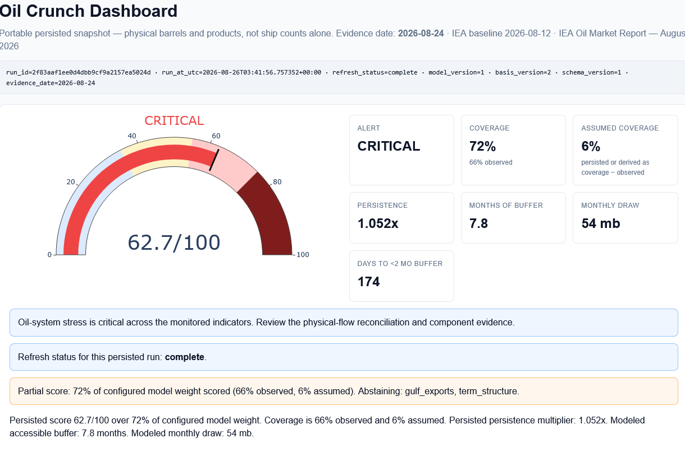
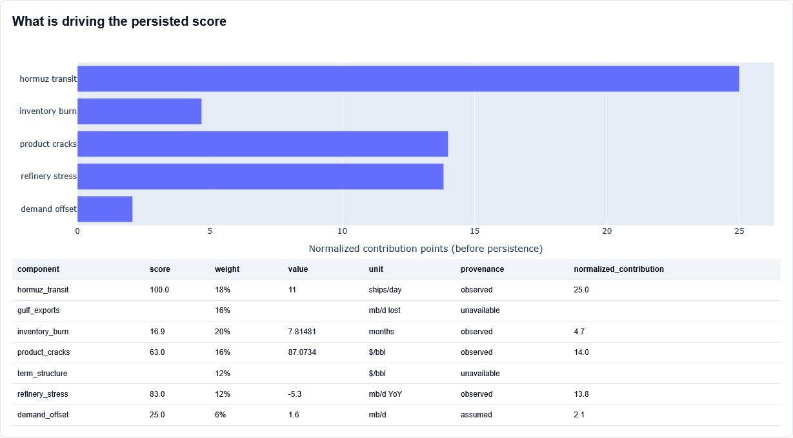
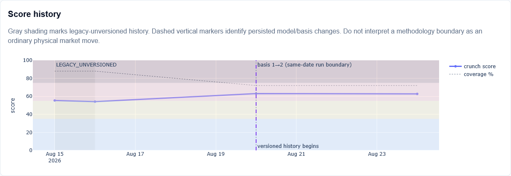
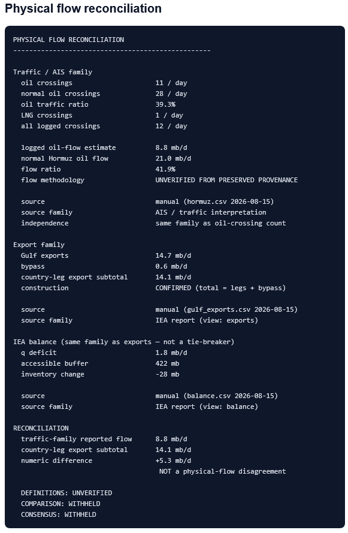
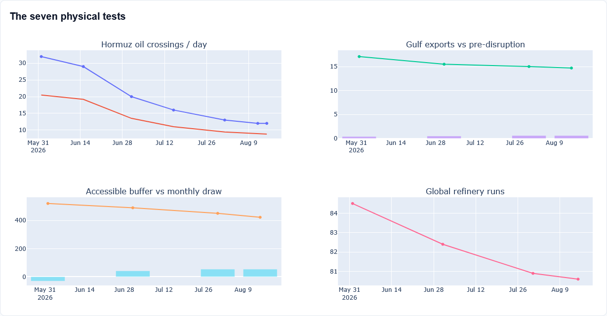
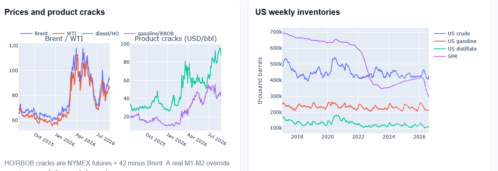

# Dashboards

Two dashboards, generated under the same governance framework but versioned
independently, because the oil and gas systems fail in different places and on
different clocks.

Both are static, self-contained artifacts built from persisted run snapshots.
Neither fetches at view time, so a rendered dashboard always corresponds to one
identified run under one identified basis version.

---

## European gas and LNG — descriptive state


*Built 2026-08-29 · latest gas day 2026-08-24 (storage and terminals),
2026-08-27 (pipeline and production).*

**No score, weight, threshold or alert is produced from the LNG dashboard.**
The gas chain runs liquefaction → carrier → terminal → pipeline → storage →
withdrawal, and the dashboard observes only parts of its European end.

What the seven cards establish, and what each one refuses to claim:

| Card | Reading | What it does not establish |
| --- | --- | --- |
| EU storage (AGSI+) | 715.2 TWh, 63.28% full | Storage flow is a first difference, sign-flipped so withdrawal is positive. Unavailable rows are explicit, never zero. |
| EU LNG send-out (ALSI+) | 3,258.7 GWh/d | Terminal inventory stays in mcm LNG. Converting it would need a regasification ratio this dashboard does not apply. |
| External pipeline (ENTSOG) | 4,401.8 GWh/d, `PROVISIONAL` | The same cross-border flow may be reported from both sides of a connection. Until those duplicates are consistently identified and removed, the total remains provisional rather than a validated measurement of European pipeline imports. |
| Reported production (ENTSOG) | 761.4 GWh/d, `PARTIAL EU COVERAGE` | Transmission-operator-visible aggregation across 11 countries — not EU production. A falling member count is not falling production. |
| Apparent demand | 5,031.3 GWh/d seven-day mean, `PROVISIONAL` | A residual identity, not a measurement. It absorbs every error in the terms above it. |
| Shipping disruption (PortWatch) | 3.5% of baseline transits, `NOT LNG-SPECIFIC` | An all-vessel AIS proxy shown for context and not added to the European balance. AIS undercounts when transponders go dark, which is likeliest in exactly the conditions the series is meant to detect. |
| U.S. LNG supply (EIA) | 16.22 Bcf/d, `MONTHLY / STALE` | Upstream context, not additive to the European balance — U.S. LNG reaching Europe already appears in terminal inventory and send-out. Daily feedgas is a disclosed gap, not an estimate. The STEO figure beside it is labelled `FORECAST` and is not in the persisted actual series. |

Both pipeline cards state their reporting denominators. External pipeline covers
37 of 44 entry members and 30 of 37 exit members; production covers 19 of 21
identities across 10 of 11 countries. This keeps changes in coverage visible
alongside changes in reported flow.

The footer defines the balance identity and withdrawal-positive storage flow.
European energy figures include Bcf equivalents for comparison, while their
underlying values remain stored in source units. The context panels excluded
from the European balance are identified separately.

The exclusion of cards 6 and 7 is deliberate and stated directly on the
dashboard. The shipping card is an all-vessel proxy rather than a European
gas-flow measure, while U.S. LNG reaching Europe already appears in terminal
inventory and send-out.

---

## Oil crunch dashboard

Five sections below. Each screenshot is a section of one continuous page; the
full-page capture is linked at the end.

### 1 of 5 — System state and evidence coverage



**Snapshot shown: 62.7/100 on evidence date 2026-08-24, basis version 2, with
72% of configured model weight scored — 66% observed and 6% assumed.
`gulf_exports` and `term_structure` abstained.**

This is a dated snapshot under a stated basis version, not a current score. The
run identifier, run timestamp, refresh status, model/basis/schema versions and
evidence date are printed in the header so any displayed figure can be traced
to the exact run that produced it.

Note the coverage split. Weight that is *observed* and weight that is *assumed
or persisted* are reported separately rather than summed into one reassuring
percentage, and the partial-score banner names the abstaining components rather
than hiding that renormalisation.

### 2 of 5 — What is driving the score



Every component carries a `provenance` value — `observed`, `assumed` or
`unavailable` — beside its score, weight, raw value and unit. That column is
what makes the coverage split auditable rather than asserted: `demand_offset`
is marked `assumed` and is the entire 6% assumed weight, while `gulf_exports`
and `term_structure` are `unavailable` and contribute nothing at all.

`hormuz_transit` is the only component at 100.0 in this snapshot. Contribution
points are shown before persistence; that final adjustment reflects how long
depressed Strait traffic has continued without changing the component weights
shown in the table.

The abstaining rows remain visible, showing that 28% of configured weight
contributes nothing because the required evidence is unavailable, not because
those components were omitted from the model.

### 3 of 5 — Score history with methodology boundaries



The shaded span marks scores recorded before methodology versions were tracked.
The dashboard calls each methodology version a `basis`; the dashed marker
records the change from `basis 1` to `basis 2` between two runs using the same
evidence date. The chart explicitly warns that this boundary should not be read
as an ordinary market move.

This is the part of the system I would point at first. A score series that
silently mixes physical movement with methodology change is worse than no
series, because it invites exactly the wrong inference. Marking the boundary in
the artifact itself means a reader cannot accidentally attribute a methodology
change to the oil market.

The dotted coverage line runs alongside the score for the same reason: a score
that rises while coverage falls is a different event from one that rises while
coverage holds.

### 4 of 5 — Physical flow reconciliation



This panel is where the evidence-family rules become visible on screen.

The traffic family declares its own lineage rather than leaving it to be
inferred: `source family: AIS / traffic interpretation`, and
`independence: same family as oil-crossing count`. The logged flow estimate of
8.8 mb/d carries `flow methodology: UNVERIFIED FROM PRESERVED PROVENANCE` on
its face — the value is displayed, and the fact that its derivation cannot be
reconstructed is displayed beneath it.

The export family does the same, and the IEA balance block is labelled
`same family as exports — not a tie-breaker`. Three quantities from one report
occupying three different model slots are still one measurement family, and
saying so in the artifact prevents them being counted as mutual corroboration.

The reconciliation block then compares the traffic-family flow against the
country-leg export subtotal and labels the +5.3 mb/d gap a **numeric
difference**, annotated `NOT a physical-flow disagreement`. It closes with
three verdicts:

```text
DEFINITIONS: UNVERIFIED
COMPARISON:  WITHHELD
CONSENSUS:   WITHHELD
```

A numeric difference between quantities whose definitions have not been
established as comparable cannot support a physical-flow verdict, so the panel
withholds one.

The construction line, `CONFIRMED (total = legs + bypass)`, means only that the
total can be reconstructed from the stated components; it does not validate the
underlying measurements.

### 5 of 5 — Trend panels



The disruption is traced across four of the seven physical tests, on a common
timeline from pre-escalation to the current evidence date. The panel for
Persian Gulf producer exports draws the export series and near-zero bypass bars
separately rather than combining them.



Left: Brent and WTI with the model's Brent-based product-margin proxies — NYMEX
heating-oil and RBOB futures converted to dollars per barrel, then measured
against Brent. Neither proxy is derived from the other, and no generated jet
crack is shown. A real M1–M2 quote is accepted only through the manual override
path. None is present, so `term_structure` abstains rather than substituting a
proxy.

Right: US crude, gasoline, distillate and strategic stocks over a decade. These
weekly US series form an independent evidence family with no vessel-tracking
parentage.

The linked full-page capture also includes a descriptive EIA physical-state
panel carrying, for each series, its level, week-over-week, 4-week, 13-week and
year-on-year change, its same-season rank out of six, and a midrank seasonal
percentile with `n` and the contributing reference-year count displayed.
Exact-date matching governs it: week-over-week requires an observation exactly
seven calendar days earlier and year-over-year exactly 364, with no
interpolation and no nearest-date tolerance. It ends where it should —
*descriptive only, no score, no weight, no causal attribution*.

[**View the complete full-page oil-dashboard capture →**](assets/oil-dashboard-full.png)

---

## What both dashboards share

- Both dashboards display source identities, evidence dates and quality states.
- The two subsystems keep separate evidence dates and freshness values. Where
  they differ, the difference is displayed rather than reconciled to a single
  date.
- Where seasonal comparisons are shown, they disclose their observation count
  and the confirmed/estimated quality composition of the reference sample.
- Absence is never filled. `UNAVAILABLE`, `STALE` and `FETCH DEGRADED` are
  distinct states, and none of them is a zero.
- The only forecast shown is the STEO context figure, explicitly labelled
  `FORECAST`; it enters neither balance nor score. See
  [limitations.md](limitations.md).
